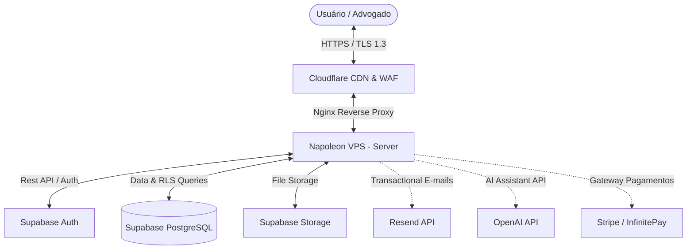

# SOC 2 System Description — SocialJurídico Platform

**Versão:** 2026-06-16  
**Status:** Baseline de Prontidão  
**Referência:** AICPA Trust Services Criteria (Security / Common Criteria)  

Este documento fornece a descrição detalhada do sistema da plataforma **SocialJurídico**, seus limites, arquitetura, fluxos de informação, fornecedores (subservice organizations), controles do cliente e exclusões de escopo, servindo de base formal para a preparação da auditoria SOC 2 Security.

---

## 1. Serviços Oferecidos (Services Offered)

O **SocialJurídico** é uma plataforma SaaS (Software as a Service) desenvolvida para otimizar a gestão de escritórios de advocacia, centralizar o acompanhamento de processos judiciais e garantir a cadeia de custódia na comunicação legal. Os principais serviços incluem:

*   **CRM Jurídico**: Gestão de clientes, controle de prazos e fluxo de casos ativos.
*   **Blindagem de Provas & Notificação Extrajudicial**: Geração de notificações extrajudiciais eletrônicas com registro de integridade de data, horário, IP hashed e confirmação de leitura em cadeia de custódia.
*   **Anjo Jurídico (IA)**: Módulo de inteligência artificial de suporte ao cliente, traduzindo termos e peças jurídicas complexas para linguagem acessível.
*   **Videochamadas**: Canal seguro e nativo para reuniões de atendimento cliente-advogado.
*   **Painel Financeiro**: Controle de honorários, fluxo de caixa e gestão de cobrança do escritório.

---

## 2. Limites do Sistema (System Boundaries)

O sistema sob escopo do exame SOC 2 abrange a infraestrutura lógica, componentes de software, pessoas e dados que constituem a plataforma SocialJurídico, delimitados da seguinte forma:

*   **Lado do Cliente (Client-Side)**:
    *   Aplicação Web acessível via navegadores (Next.js SPA).
    *   Aplicativo Móvel para sistemas iOS e Android (React Native).
*   **Lado do Servidor (Server-Side)**:
    *   Servidor de Aplicação hospedado na **Napoleon VPS** (Nginx, Docker Compose).
    *   Serviço analítico de borda e segurança (Cloudflare DNS, SSL/TLS e WAF).
*   **Camada de Persistência e Auth**:
    *   Banco de dados relacional PostgreSQL gerenciado pelo **Supabase** (com Row Level Security - RLS).
    *   Buckets de armazenamento (Supabase Storage) para documentos anexados.
    *   Provedor de identidade (Supabase Auth).

---

## 3. Arquitetura e Infraestrutura (Architecture & Infrastructure)

### Componentes de Infraestrutura:
1.  **Rede e Segurança de Borda**: Cloudflare gerencia a zona de DNS, impõe versão mínima TLS 1.2/1.3, gerencia cabeçalhos de segurança HTTP e bloqueia ameaças na camada de aplicação via Web Application Firewall (WAF).
2.  **Hospedagem de Aplicação**: Napoleon VPS (Servidor de Produção no IP `177.136.229.79`). Configurada em container Docker isolado, Nginx como proxy reverso e chaves SSH privadas estritas para acesso operacional. Localizada geograficamente no Brasil.
3.  **Banco de Dados e Armazenamento**: Supabase. Banco de dados PostgreSQL configurado com backups diários automáticos, replicação lógica e chaves de segurança de banco (Service Role e JWT keys). Bucket de arquivos com criptografia em repouso.
4.  **Integrações Externas**: OpenAI (para processamento de IA do Anjo Jurídico), Resend (notificações transacionais de e-mail), Stripe e InfinitePay (processamento financeiro de assinaturas).

---

## 4. Fluxos de Informação Críticos (Information Flows)

### 4.1 Autenticação e Autorização (MFA e RLS)
1.  O usuário insere as credenciais na interface. O tráfego passa criptografado via TLS 1.3 pela Cloudflare.
2.  A API do Supabase Auth processa a credencial e gera um token JWT assinado.
3.  Todas as requisições subsequentes ao banco carregam esse token no header HTTP `Authorization`.
4.  O banco de dados PostgreSQL avalia o JWT do usuário contra as políticas de **Row Level Security (RLS)** criadas em cada tabela (como `clientes`, `casos` e `notificacoes`), garantindo que um usuário acesse exclusivamente registros vinculados ao ID do seu próprio escritório.

### 4.2 Notificação Extrajudicial e Cadeia de Custódia
1.  O advogado submete dados de uma notificação na plataforma.
2.  O sistema gera hashes SHA-256 do arquivo e do payload, salvando na tabela imutável de auditoria.
3.  Um token único criptografado é enviado por e-mail (via Resend) para o destinatário.
4.  Ao abrir o link, o destinatário acessa uma página estática segura. Os metadados da abertura (horário, User-Agent, hashes de e-mail e IP) são salvos de forma imutável em logs sem armazenar informações sensíveis brancas.

---

## 5. Organizações de Subserviço (Subservice Organizations)

Determinadas funções de infraestrutura de TI do SocialJurídico são delegadas a provedores terceiros cujos controles de segurança são auditados de forma independente (SOC 2 Tipo II ou PCI-DSS):

*   **Supabase / AWS**: Responsável pela integridade física dos servidores de banco de dados, armazenamento físico de buckets e processamento lógico do motor Postgres. (Nuvem em conformidade SOC 2 / ISO 27001).
*   **Napoleon Hospedagem**: Provedor de infraestrutura de rede, virtualização do servidor VPS e conectividade local dos data centers brasileiros. (Data center redundante com controles de acesso físico e lógico auditados).
*   **Cloudflare**: Responsável pelo tráfego de borda, mitigação de ataques DDoS volumétricos, entrega de certificados de criptografia SSL/TLS e proteção HTTP de rede.
*   **OpenAI**: Processamento de modelos de linguagem natural (LLM) usados no módulo Anjo Jurídico. (Políticas de retenção de zero-data para APIs ativas sob auditoria SOC 2).

---

## 6. Controles Complementares de Entidade Usuária (User Entity Controls - CCEU)

A eficácia operacional da segurança do SocialJurídico depende de ações e controles executados pelos clientes (escritórios de advocacia contratantes) nos seguintes pontos:

1.  **Gestão de Credenciais**: Os escritórios clientes devem assegurar que senhas fortes e MFA (Autenticação Multifator) sejam ativadas e exigidas para todos os seus advogados e operadores autorizados.
2.  **Revisão de Acesso**: Os administradores dos escritórios clientes devem desativar perfis e remover acessos de colaboradores desligados de seu quadro técnico de forma imediata na plataforma.
3.  **Base Legal e Direitos**: Os usuários clientes devem obter o consentimento ou base legal correspondente de seus clientes finais antes de cadastrar dados pessoais sensíveis e processos judiciais no sistema.

---

## 7. Exclusões de Escopo (Scope Exclusions)

Os seguintes serviços integrados à plataforma são expressamente excluídos do escopo deste exame SOC 2:

*   **Processamento de Pagamento (Stripe/InfinitePay)**: O armazenamento de dados de cartão de crédito e a compensação financeira de transações ocorrem integralmente nos servidores da Stripe e InfinitePay sob certificações de conformidade PCI-DSS Tier 1 de cada gateway de pagamento.
*   **Ambientes Locais dos Usuários**: A segurança de endpoints físicos (notebooks, smartphones pessoais) dos advogados clientes e seus clientes finais está fora dos limites de controle do SocialJurídico.
