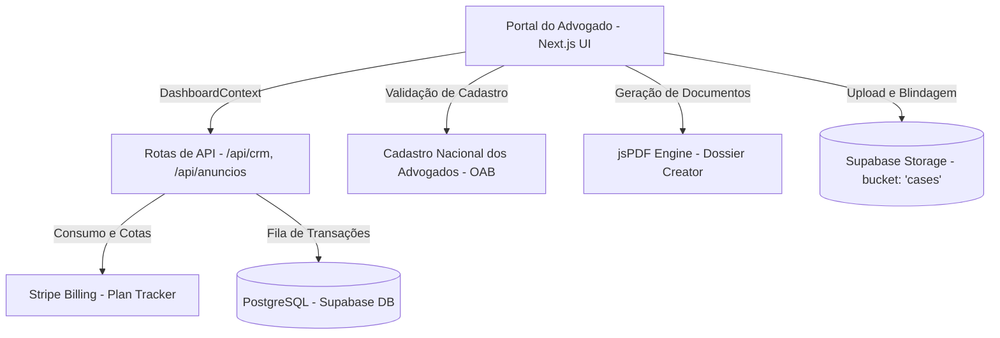

# 🛡️ RELATÓRIO TÉCNICO DE ARQUITETURA & INFRAESTRUTURA
## SocialJurídico — Portal do Advogado: Topologia, Segurança e Pipelines Operacionais (v2.5)

Este documento apresenta uma revisão técnica detalhada sobre a arquitetura de software, controles de acesso baseado em regras (RBAC), governança de banco de dados, pipelines de dados e ferramentas de produtividade referentes ao **Portal do Advogado (Lawyer Dashboard)** do **SocialJurídico (SJ)**. Este laudo serve como referência técnica para auditorias internas de governança e escalabilidade do ecossistema.

---

## SEÇÃO 1: RESUMO EXECUTIVO DO PORTAL DO ADVOGADO
O Portal do Advogado funciona como o núcleo operacional da plataforma, integrando captação de clientes, CRM, faturamento e ferramentas de inteligência jurídica. A arquitetura baseia-se em um provedor de contexto centralizado (`DashboardContext.js`) que encapsula todos os estados da aplicação, as chamadas para Route Handlers do Next.js e conexões em tempo real com o barramento do Supabase.

A topologia do ecossistema operacional do advogado é detalhada a seguir:



---

## SEÇÃO 2: MATRIZ DE PERMISSÕES, SANDBOX DE ACESSO & SEGURANÇA (RBAC)

Para atender a escritórios corporativos e estruturas com múltiplos níveis funcionais, o painel do advogado implementa uma matriz fina de controle de acesso baseado em perfis e papéis (**Role-Based Access Control - RBAC**):

### 1. Sandbox de Acesso para Estagiários
Os estagiários operam em um ambiente controlado de testes (sandbox), em que as seguintes 9 ferramentas premium podem ser ativadas ou desativadas dinamicamente pelo Gestor do escritório por meio de chaves booleanas armazenadas em um campo JSONB (`permissoes`):
1.  **Assinatura Digital** (`ferr_assinatura`)
2.  **Meus Clientes (CRM)** (`ferr_crm`)
3.  **IA Smart Docs** (`ferr_smart_docs`)
4.  **Blindagem de Provas** (`ferr_blindagem`)
5.  **Redator IA** (`ferr_redator_ia`)
6.  **Agenda & Prazos** (`ferr_agenda`)
7.  **Triagem de Casos** (`ferr_triagem`)
8.  **Calculadora** (`ferr_calculadora`)
9.  **Jurisprudência** (`ferr_jurisprudencia`)

### 2. Sandbox de Restrições para Secretárias
As secretárias têm permissões voltadas ao agendamento e triagem administrativa. Seus acessos a ferramentas técnicas de direito (como *Redator IA* e *Jurisprudência*) são bloqueados por padrão.
*   **Controle de Feedback:** Tentativas de acesso não autorizado por estagiários ou secretárias interceptam a navegação e disparam alertas dinâmicos via `toast.error`, preservando a integridade das funções exclusivas dos advogados.

### 3. Validação do Registro Profissional (OAB Verification Status)
O portal executa rotinas de consistência cadastral baseadas no Cadastro Nacional dos Advogados (CNA):
*   Se o status de verificação da OAB do profissional retornar como `ERROR` (inconsistente ou suspenso), a plataforma barra o login, redirecionando o usuário para uma tela de bloqueio e desativando sua listagem no portal de busca de clientes até a regularização manual com a administração.

---

## SEÇÃO 3: MOTOR FINANCEIRO, CREDENCIAMENTO & CONSUMO DE COTAS

A viabilidade financeira e o controle de consumo do portal são operados por meio de três pilares:

### 1. Livro Caixa e Faturamento do CRM (Invoicing Ledger)
Dentro do CRM, cada cliente possui um painel financeiro para controle de honorários e reembolsos:
*   **Métricas em Tempo Real:** O sistema computa o faturamento previsto e recebido no mês corrente através de cálculos automáticos.
*   **Trilha de Auditoria Silenciosa:** Qualquer mudança no status de pagamento de um lançamento financeiro ("PENDENTE" para "PAGO" ou vice-versa) grava de forma imutável um log de auditoria na timeline do CRM do cliente, registrando o valor da transação, o nome e o cargo do operador (ex: Gestor, Secretária, Advogado).

### 2. O Modelo de Cobrança em Juris (Moeda Interna)
*   **Manifestação de Interesse:** Manifestar interesse em oportunidades de novos casos consome 1 Juri do advogado. Se o cliente declinar ou o caso for finalizado sem aceitar o profissional, o sistema estorna o crédito de forma transparente, desde que atendidos os requisitos de não-vínculo prévio.
*   **Blindagem de Provas:** A autenticação e registro de hashes de arquivos probatórios na blockchain/servidor consome 3 Juris por documento no plano START, sendo gratuito e ilimitado para usuários PRO.

### 3. Limitação e Controle de Consumo
A interface do advogado possui barras de progresso que exibem a cota ativa e o consumo do plano atual (`FREE`, `START`, `PRO`):
*   **Redator IA:** Mapeia a quantidade de documentos gerados via inteligência artificial contra o limite contratado.
*   **Clientes CRM e Agenda:** Controla a criação de novos registros no banco, bloqueando transações excedentes e disparando popups de atualização de plano integrados ao Stripe Checkout.
*   **Armazenamento (Smart Docs):** Mede em Megabytes/Gigabytes o espaço ocupado por anexos do CRM no Supabase Storage.

---

## SEÇÃO 4: FERRAMENTAS PREMIUM, GERADOR DE DOSSIÊS E COMPLIANCE

As ferramentas premium do painel agilizam fluxos processuais e garantem integridade jurídica aos atos realizados na plataforma:

### 1. Gerador Inteligente de Dossiês do CRM (PDF Export)
A aplicação integra a biblioteca `jsPDF` com o resolvedor de tabelas `jspdf-autotable` para compilar o dossiê do cliente final em um único arquivo PDF estruturado:
*   O relatório reúne em tempo real dados cadastrais, KYC processado por inteligência artificial (IA Insights), histórico financeiro completo e a timeline cronológica de interações.

### 2. Emissão de Modelos Legais (Quick Document Generate)
*   Integrado diretamente com os dados estruturados do CRM, o advogado pode exportar informações do cliente para minutas pré-configuradas de **Contrato de Honorários** ou **Procurações (Ad Judicia)**, preenchendo qualificações de forma automatizada.

### 3. Blindagem de Evidências e Assinatura Eletrônica
*   **Segurança de Evidências (SHA-256):** Arquivos probatórios sensíveis passam por cálculo criptográfico de hash SHA-256 em tempo de upload. O hash resultante é gravado no banco de dados, estabelecendo uma cadeia de custódia imutável.
*   **Assinatura Digital Conformidade (MP 2.200-2/2001):** Permite a assinatura eletrônica de documentos colhendo e selando metadados de auditoria: endereço de IP do signatário, coordenadas de geolocalização do dispositivo, dados do navegador (User-Agent), hash do documento e representação visual da assinatura.

---

## SEÇÃO 5: MARKETPLACE DE SERVIÇOS & COMUNICAÇÃO DE BORDA

*   **1. Marketplace Interno de Serviços (Anúncios):**
    O portal integra um canal de busca e publicação de ofertas voltado a serviços técnicos. Os advogados podem consultar de forma otimizada anúncios de prepostos e prestadores de diligências (cálculos, perícias e cópias processuais) segmentados em três categorias de transação: `PREPOSTOS`, `DILIGÊNCIAS` e `OUTROS`.
*   **2. Comunicação de Equipe (Corporate Hub):**
    Advogados vinculados a escritórios contam com uma aba de comunicação integrada. A sincronização de mensagens não lidas opera de forma dinâmica, limpando a notificação no banco de dados via Route Handler (`PATCH /api/notificacoes`) assim que a aba de mensagens é acessada pelo profissional.

---

## SEÇÃO 6: CONFORMIDADE & PRONTIDÃO TÉCNICA (PORTAL DO ADVOGADO)

Com base nas análises das ferramentas de faturamento, controle de sandbox (RBAC) e sincronização estrutural do painel:

> **"O painel do advogado do SocialJurídico cumpre as diretrizes de governança multi-tenant e oferece isolamento dinâmico de recursos sensíveis de acordo com regras de hierarquia de cargos e cotas contratuais."**

```
📊 INDICADORES DE CONFORMIDADE DA ARQUITETURA DO ADVOGADO:
🛡️ Sandbox Estagiário & Secretária (RBAC) -------> [ VERIFICADO ]
🔗 Sincronização e Bloqueio OAB Inconsistente ---> [ VERIFICADO ]
⚙️ Motor de Cotas e Faturamento (Stripe) --------> [ VERIFICADO ]
📋 Livro Caixa CRM & Timeline Auditável ---------> [ VERIFICADO ]
⚖️ Cadeia de Custódia SHA-256 (Blindagem) -------> [ VERIFICADO ]
📄 Exportador de Dossiê PDF (jsPDF Engine) ------> [ VERIFICADO ]
```

---

## SEÇÃO 7: DISCLAIMER INSTITUCIONAL

> [!IMPORTANT]
> **DISCLAIMER:** Este laudo tem fins exclusivamente informativo-tecnológicos, revisando e consolidando a topologia arquitetônica interna implementada no portal do advogado. Ele não anula nem substitui auditorias formais independentes de segurança e auditorias forenses (SOC2, ISO/IEC 27001).

**SOCIALJURÍDICO 2026 — RELATÓRIO TÉCNICO DO PORTAL DO ADVOGADO (V2.5)**  
*Documento compilado em 21 de maio de 2026.*
