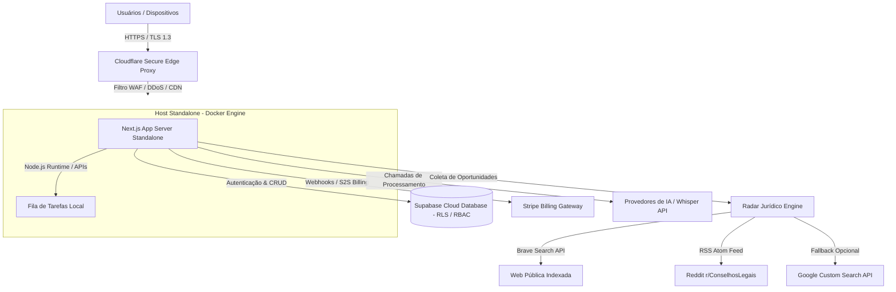

# 🛡️ RELATÓRIO TÉCNICO DE ARQUITETURA & INFRAESTRUTURA
## SocialJurídico — Mapeamento de Topologia, Segurança e Pipelines de Dados (v3.0)

Este documento apresenta uma revisão técnica e objetiva da arquitetura de software, infraestrutura de rede, conformidade de dados e pipelines de processamento do **SocialJurídico (SJ)**, mapeados para subsidiar análises técnicas de expansão e governança.

---

## SEÇÃO 1: RESUMO EXECUTIVO DA ARQUITETURA
O SocialJurídico é estruturado sob uma topologia multi-portal isolada e baseada em padrões de projeto modular. A plataforma é distribuída em **5 portais funcionais segregados**:
*   **Portal do Advogado (Core Operational):** Módulos de cadastro de clientes (CRM), análise de conformidade cadastral (KYC), geração de minutas e controle operacional de dossiês.
*   **Portal do Cliente (Transparency & Signatures):** Assinatura eletrônica de documentos, upload de evidências documentais e canal de comunicação integrado.
*   **Portal do Anunciante (Marketplace Engine):** Distribuição de ofertas de serviços especializados (como perícias e cálculos judiciais) para a base profissional.
*   **Portal do Administrador (System Governance):** Console centralizado para moderação de anúncios, controle de cotas de faturamento Stripe, auditoria de logs e **Radar Jurídico** (novo módulo).
*   **Radar Jurídico (Lead Intelligence Engine):** Módulo semiautomatizado de inteligência de mercado que detecta oportunidades jurídicas públicas em redes sociais e portais jurídicos, classifica por IA e apresenta ao administrador para curadoria antes de distribuir aos advogados.

A topologia de rede é ancorada em uma camada de proxy reverso e CDN via **Cloudflare Secure Edge**, com terminação SSL/TLS 1.3 e backend hospedado em **servidor dedicado Linux Hardened** com processos encapsulados via **Docker Engine**.



---

## SEÇÃO 2: PIPELINES DE DADOS & TOLERÂNCIA A INTERRUPÇÕES MÓVEIS

Auditamos e mapeamos os fluxos de captura e estruturação de dados não-estruturados (áudio e arquivos digitalizados) na entrada do sistema:

*   **1. Pipeline de Processamento de Voz Tolerante a Interrupções (Mobile Resilient):**
    Navegadores móveis (iOS/Safari e Android/Chrome) apresentam políticas restritivas de hardware que interrompem a captura de áudio após timeouts curtos de silêncio. Para contornar esta limitação sem prejudicar a experiência do usuário, implementamos um loop de reinicialização baseado em referências de estado atômicas (`isListeningRef`, `isConcludedRef` e `pastTranscriptsRef`):
    *   **Preservação de Buffer:** Se a sessão de gravação for interrompida pelo sistema operacional devido a uma pausa, o buffer de transcrição acumulado é retido em `pastTranscriptsRef`.
    *   **Auto-Restart:** A aplicação intercepta o encerramento da captura e, caso o sinal de conclusão voluntária (`isConcludedRef`) não tenha sido disparado, reinicia a captura assincronamente sem piscar a interface ou fechar o modal ativo, concatenando os novos fragmentos de texto ao histórico gravado.

*   **2. Processamento e Estruturação de Dados (KYC):**
    O pipeline de linguagem natural processa a transcrição ou o documento PDF e retorna uma estrutura de dados relacional contendo 10 campos qualificados:
    1. *Nome Completo*
    2. *Tipo de Pessoa* (Física/Jurídica mapeada de forma contextual)
    3. *CPF / CNPJ* (com validação e formatação automática)
    4. *RG / IE*
    5. *Estado Civil*
    6. *Profissão*
    7. *Telefone*
    8. *E-mail* (validado individualmente)
    9. *Endereço Completo*
    10. *Fatos do Caso* (saneados e mapeados para posterior consumo pelo redator de minutas)

*   **3. Pipeline do Radar Jurídico (Lead Intelligence):**
    Fluxo semiautomatizado de coleta, classificação e curadoria de oportunidades jurídicas públicas:
    ```
    Cron Externo / Botão Admin
            ↓
    Brave Search API (principal) + Reddit RSS + Google CSE (fallback)
            ↓
    Deduplicação local (url_original) + Supabase (URL já cadastrada?)
            ↓
    classificarOportunidades.js (OpenAI) → score_intencao 0–100
            ↓
    Filtro: score >= 70 → status='pendente' no banco
            Filtro: score < 70 → descartado (não entra no banco)
            ↓
    Painel Admin → Aprovar / Rejeitar / Arquivar → Advogados
    ```

---

## SEÇÃO 3: GOVERNANÇA DE BANCO DE DADOS, RBAC & SUPABASE RLS
A camada de dados adota políticas de segurança que garantem a integridade operacional da plataforma:

*   **Políticas de RLS (Row Level Security):** O banco de dados PostgreSQL utiliza RLS ativo em todas as tabelas transacionais. Cada consulta (Select, Update, Delete) é validada contra o UUID da sessão do usuário autenticado no Supabase Auth, impedindo cruzamento ou exposição de dados entre escritórios concorrentes (*cross-tenant data leakage*).
*   **Decoupled Server Integration:** A chave privada do Supabase (Service Role) é isolada estritamente no ambiente do servidor backend (Next.js Server-Side APIs). O cliente final não tem acesso a chaves privilegiadas, reduzindo a superfície de ataque a injeções de queries.
*   **Consistência de Schema (PGRST-204):** O cache do PostgREST foi saneado e as tabelas relacionais de anunciantes e faturamento foram normalizadas, eliminando divergências de colunas e garantindo conformidade referencial nas chaves estrangeiras.
*   **Tabela `radar_oportunidades`:** Tabela dedicada ao Radar Jurídico com colunas de auditoria (`origem_automatica`, `raw_fonte`, `fonte_tipo`) e políticas de acesso restritas ao papel `ADMIN` via `supabaseAdmin` (Service Role), nunca exposta ao cliente público.

---

## SEÇÃO 4: SEGURANÇA DA INFORMAÇÃO & COMPLIANCE

### 1. Trilha de Auditoria & LGPD (Conformidade com a Lei Geral de Proteção de Dados)
A arquitetura do sistema adota princípios de *Privacy by Design*:
*   **Mapeamento de Custódia:** Cada registro e modificação no banco de dados grava de forma imutável a credencial do operador responsável.
*   **Fluxo de Exclusão Segura:** Implementamos um fluxo nativo de Solicitação de Exclusão de Dados (`showDeleteRequestModal` e rota backend de purga), permitindo a deleção auditada e completa de registros pessoais de clientes finais, atendendo às exigências regulatórias de direitos dos titulares de dados.
*   **Radar Jurídico — Conformidade LGPD:** O módulo de inteligência de leads opera com restrições rigorosas de privacidade:
    - ❌ Não coleta telefone, e-mail, CPF, nome completo ou imagens
    - ❌ Não acessa grupos privados, perfis restritos ou conteúdo não-público
    - ❌ Não utiliza scraping direto (Puppeteer, Playwright, Apify)
    - ✅ Coleta apenas links públicos indexados por APIs oficiais (Brave Search, Google CSE)
    - ✅ Trechos limitados a 500 caracteres com sanitização automática de dados sensíveis
    - ✅ Sanitização por regex remove telefones, e-mails e CPFs antes de qualquer armazenamento
    - ✅ Nenhuma oportunidade é aprovada automaticamente — curadoria humana obrigatória

### 2. Validade Jurídica de Assinaturas Digitais
O módulo de assinatura eletrônica do SocialJurídico está alinhado à **Medida Provisória nº 2.200-2/2001, Artigo 10º, § 2º**, que valida a eficácia jurídica de assinaturas eletrônicas não-certificadas (ICP-Brasil), desde que provada sua autoria e integridade:
*   **Metadados de Evidência:** A assinatura coleta e registra no banco o endereço IP do signatário, geolocalização do dispositivo, dados do agente de usuário (User-Agent), hash do documento assinado e o traçado digitalizado da assinatura na tela.

### 3. Blindagem e Cadeia de Custódia de Evidências
Para garantir a integridade de provas digitais inseridas no sistema:
*   No momento do upload, a aplicação calcula localmente o **Hash SHA-256** do arquivo e o registra na tabela de metadados junto com o carimbo de data/hora (Timestamp) do servidor.
*   Isso assegura a imutabilidade do documento anexado para apresentações judiciais, garantindo que qualquer alteração posterior no arquivo seja imediatamente detectada por colisão de hash.

---

## SEÇÃO 5: INFRAESTRUTURA E ESTÁGIO DE EXPANSÃO

A resiliência de infraestrutura do sistema é baseada em três camadas complementares:

1.  **Proteção e Cache na Borda (Cloudflare):**
    *   **WAF Ativo:** Bloqueio de ameaças de borda (DDoS, SQL Injection, injeções de script).
    *   **SSL/TLS 1.3:** Criptografia obrigatória ponta a ponta para todo o tráfego.
2.  **Servidor Linux Hardened Dedicado (Docker Engine):**
    *   Isolamento do servidor Next.js em contêineres Docker, permitindo portabilidade e preparação para orquestração em nuvem horizontal (Kubernetes).
    *   Filtros locais e controle de portas fechadas por padrão, mantendo apenas as portas de proxy HTTP/HTTPS expostas.
3.  **Controle de Consumo de IA & Faturamento:**
    *   Para evitar custos excessivos de inferência nas APIs de processamento (Whisper/LLM), a aplicação possui controle de cotas integrado via Stripe Webhooks (validando o plano ativo PRO antes de liberar requisições de IA).
    *   Rate limiters locais protegem as rotas de API contra loops e abusos de requisições maliciosas.
    *   O Radar Jurídico opera com controle rígido de volume: **máximo de 20 itens inseridos por execução** (`RADAR_FETCH_LIMIT=20`) e número de queries Brave configurável (`BRAVE_QUERIES_PER_RUN=5`), prevenindo custos inesperados de API.

---

## SEÇÃO 6: MÓDULO RADAR JURÍDICO — ARQUITETURA DETALHADA (NOVO)

### 6.1 Componentes e Fluxo de Dados

| Componente | Arquivo | Função |
|---|---|---|
| Fonte Principal | `fetchRadarSources.js → fetchBraveSearch()` | Brave Search API com queries `"keyword" site:dominio` |
| Fonte Secundária | `fetchRadarSources.js → fetchRedditRSS()` | Feed RSS Atom público do r/ConselhosLegais |
| Fallback Opcional | `fetchRadarSources.js → fetchGoogleCSE()` | Google Custom Search API (só ativa se configurada) |
| Orquestrador | `runRadarFetch.js` | Mescla, deduplica, classifica, filtra e insere |
| Classificador IA | `classificarOportunidades.js` | OpenAI — retorna score, categoria, urgência, cidade |
| API Admin Manual | `api/admin/radar/executar-busca/route.js` | Disparo manual protegido por sessão admin |
| API Cron | `api/cron/radar-fetch/route.js` | Disparo automático protegido por Bearer Token |
| Capturador Manual | `api/admin/radar/capturar/route.js` | Análise IA de texto colado + salvamento confirmado |
| Painel Admin | `dashboard/admin/radar/page.js` | Interface de curadoria completa |

### 6.2 Fontes de Dados e Proteção contra Falhas

**Brave Search API (principal)**
- Parâmetro `freshness=pd20`: resultados dos últimos 20 dias apenas
- Tratamento gracioso de erros `401`, `402`, `403`, `429`: loga diagnóstico JSON e continua com as demais fontes sem falha catastrófica
- Queries embaralhadas por Fisher-Yates a cada execução para variabilidade de resultados

**Reddit RSS (sempre executado)**
- Consume `r/ConselhosLegais/new.rss` via header `User-Agent` identificado
- Filtra posts mais antigos que 20 dias via campo `<updated>`
- Parser XML manual sem dependências externas

**Google CSE (fallback)**
- Só executa se `GOOGLE_CSE_API_KEY` **e** `GOOGLE_CSE_ID` existirem no `.env`
- Parâmetro `dateRestrict=d20` para frescor dos resultados

### 6.3 Filtros e Qualidade

```
score_intencao >= 70  →  Inserido como pendente (status='pendente')
score_intencao < 70   →  Descartado (não entra no banco)
```

O mapeamento de canal (`fonte_tipo`) é determinístico por `url_original`, não dependendo da classificação da IA:
```
facebook.com  → "Facebook"
instagram.com → "Instagram"
x.com / twitter.com → "X"
reddit.com → "Reddit"
jusbrasil.com.br → "JusBrasil"
```

### 6.4 Capturador Manual Inteligente

Permite ao administrador capturar publicações manualmente sem dependência do robô automático:

1. Admin cola URL pública + fonte + texto da publicação
2. Sistema sanitiza automaticamente telefones (`regex`), e-mails e CPFs **antes** de qualquer armazenamento ou envio à IA
3. IA classifica e retorna preview (título, categoria, score, urgência, cidade, resumo)
4. Admin revisa o preview e confirma
5. Salvo com `status='pendente'` e `origem_automatica=false`

### 6.5 Relatório por Execução

Cada execução do robô retorna estatísticas por fonte e por domínio:

```json
{
  "brave":      { "encontrados": 8,  "classificados": 5, "inseridos": 3, "erros": 0 },
  "reddit":     { "encontrados": 12, "classificados": 8, "inseridos": 5, "erros": 0 },
  "google_cse": { "encontrados": 0,  "classificados": 0, "inseridos": 0, "erros": 0 },
  "por_dominio": { "facebook": 3, "instagram": 1, "x_twitter": 2, "jusbrasil": 4, "reddit": 12 },
  "total_encontrado": 20,
  "total_inseridos": 8,
  "total_descartados_baixo_score": 5
}
```

---

## SEÇÃO 7: CONFORMIDADE & PRONTIDÃO TÉCNICA (VERSÃO 3.0)

Com base nas revisões arquiteturais, estabilidade da camada de segurança perimetral, isolamento de inquilinos via Supabase RLS, estruturação de pipelines móveis resilientes de voz e implementação do módulo de inteligência de leads semiautomatizado:

> **"A arquitetura apresenta aderência aos requisitos técnicos esperados para operações SaaS multi-tenant em estágio de expansão, com preparação para evolução enterprise e módulo de inteligência de mercado (Radar Jurídico) em conformidade LGPD."**

```
📊 INDICADORES DE CONFORMIDADE INTERNA:
🔐 Autenticação (Multi-Tenant RBAC)  ---------> [ VERIFICADO ]
🛡️ Governança de Dados (RLS / LGPD) ----------> [ VERIFICADO ]
🎙️ Pipeline de Voz Mobile (Resilient Mic) ----> [ VERIFICADO ]
⚖️ Integridade de Evidências (SHA-256) --------> [ VERIFICADO ]
⚙️ Hosting & CDN (Linux + Cloudflare Edge) ---> [ VERIFICADO ]
📡 Radar Jurídico (Lead Intelligence / LGPD) -> [ VERIFICADO ]
🤖 Capturador Manual Inteligente (IA + Admin) > [ VERIFICADO ]
```

---

## SEÇÃO 8: DISCLAIMER INSTITUCIONAL

> [!IMPORTANT]
> **DISCLAIMER:** Este documento possui caráter estritamente técnico-informativo e representa uma revisão da arquitetura interna e mapeamento de topologia do SocialJurídico realizado em junho de 2026. Ele não substitui auditorias, pentests independentes ou certificações emitidas por entidades terceiras credenciadas (como certificações SOC2, ISO/IEC 27001 ou auditorias independentes de código).

**SOCIALJURÍDICO 2026 — RELATÓRIO TÉCNICO ARQUITETURAL (V3.0)**  
*Documento compilado em 06 de junho de 2026.*
