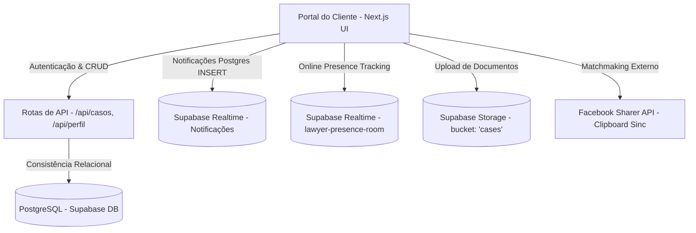

# 🛡️ RELATÓRIO TÉCNICO DE ARQUITETURA & INFRAESTRUTURA
## SocialJurídico — Portal do Cliente: Topologia, Segurança e Pipelines de Interação (v2.5)

Este documento apresenta uma revisão técnica detalhada sobre a arquitetura de software, fluxos de segurança, governança de banco de dados e pipelines de sincronização referentes ao **Portal do Cliente (Client Dashboard)** do **SocialJurídico (SJ)**. Este laudo serve como subsídio para auditorias internas de conformidade e planejamento de expansão mobile da plataforma.

---

## SEÇÃO 1: RESUMO EXECUTIVO DO PORTAL DO CLIENTE
O Portal do Cliente é estruturado como um módulo desacoplado dentro da arquitetura de Next.js. Ele atua como o ponto de controle de demandas e de busca por profissionais de advocacia. A topologia baseia-se em renderização no cliente (Client Component) integrada em tempo real com serviços em nuvem (Supabase Realtime) e APIs internas seguras (Server-Side Route Handlers).

A topologia de interação do cliente final com a plataforma é ilustrada a seguir:



---

## SEÇÃO 2: PIPELINES DE DADOS E GESTÃO DE CASOS (CRM DO CLIENTE)

O pipeline de dados do cliente é focado na recepção de novos fatos jurídicos e documentos probatórios. Mapeamos os fluxos críticos de entrada e manipulação de informações:

*   **1. Publicação de Casos com Filtro de Mídia e Upload Seguro:**
    Ao registrar uma demanda em "Novo Caso", o sistema implementa uma camada de validação e ingestão de evidências em duas etapas:
    *   **Sanitização e Validação Local:** O formulário restringe uploads a no máximo 5 arquivos. Cada arquivo passa por filtros rígidos de tamanho (máximo de 10 MB) e tipo de mídia (`application/pdf`, `image/jpeg`, `image/png`, `image/webp`).
    *   **Mapeamento e Armazenamento Isolado:** Os arquivos aprovados são enviados diretamente ao bucket `cases` no Supabase Storage sob caminhos determinísticos baseados em identificador único: `cases/${userId}/${timestamp}-${token}.${ext}`. Os links públicos gerados são gravados de forma estruturada no campo JSONB `anexos` da tabela de casos.

*   **2. Pipeline de Matchmaking Social (Facebook Group Share):**
    Para aumentar a visibilidade de novas demandas e acelerar a captação de advogados qualificados, o portal possui um integrador de compartilhamento dinâmico:
    *   **Clipboard Buffer:** O sistema extrai e formata o título e a descrição do caso e, utilizando o objeto de navegação nativo (`navigator.clipboard.writeText`), copia um sumário estruturado para a área de transferência do usuário.
    *   **Visual Cards Meta Resolver:** A plataforma gera uma URL temporária `/compartilhar?t=[titulo]&d=[descricao]` que constrói tags OpenGraph dinamicamente na borda, permitindo que a API do Facebook monte um card interativo com dados estruturados da demanda ao abrir o postador social.

---

## SEÇÃO 3: GOVERNANÇA DE BANCO DE DADOS, RBAC & SEGURANÇA
A camada de persistência utiliza filtros do PostgreSQL para segregação completa dos dados do cliente:

*   **Isolamento Baseado em RLS (Row Level Security):** 
    Tabelas cruciais de propriedade do cliente, como `casos` e `notificacoes`, possuem políticas de RLS ativas. Toda operação de leitura ou escrita do cliente é condicionada à sessão ativa (`auth.uid() = user_id`). Isso previne vazamentos acidentais de registros de casos ou de informações de identificação pessoal (*cross-tenant data leakage*).
*   **Desacoplamento de Credenciais na Borda:**
    As modificações em cadastros sensíveis e exclusões de registros são feitas via requisições autenticadas para as rotas da API em Next.js. A chave mestra do banco (`service_role`) permanece isolada no servidor, mitigando vulnerabilidades de injeção de comandos SQL diretamente no navegador.
*   **Direito ao Esquecimento e Purga de Dados (Conformidade LGPD):**
    O portal implementa a deleção completa e auditada da conta do cliente (`deleteAccountAction`), acionando gatilhos transacionais em cascata para exclusão de casos não ativos, revogação de chaves de acesso no Auth Manager do Supabase, limpeza de metadados pessoais e logout definitivo do usuário, assegurando conformidade estrita com o Artigo 18 da LGPD.

---

## SEÇÃO 4: INTEGRAÇÃO EM TEMPO REAL E CANAL DE PRESENÇA
Para aproximar clientes de defensores ativos, o portal do cliente gerencia dois barramentos de comunicação assíncronos:

*   **1. Sincronização de Presença de Advogados (lawyer-presence-room):**
    O portal subscreve-se ao canal de presença do Supabase em tempo real. Ele monitora eventos de `sync`, `join` e `leave` disparados pelos navegadores dos advogados. Esses eventos atualizam a lista interna de identificadores ativos (`onlineLawyerIds`), permitindo ao cliente identificar imediatamente quais profissionais disponíveis estão online para pronto atendimento.
*   **2. Ingestão de Notificações Dinâmicas (Push In-App):**
    Há uma escuta WebSocket dedicada à tabela `notificacoes` filtrada pelo ID do cliente conectado. O painel intercepta instantaneamente novos registros gravados pelo servidor (ex: manifestação de interesse de um advogado em um caso do cliente) e dispara alertas visuais instantâneos (`toast.custom`) que guiam o cliente para a aba de triagem de propostas.

---

## SEÇÃO 5: MOTOR DE COMPLIANCE, TRIAGEM E AVALIAÇÕES

A integridade operacional das contratações é mantida por meio de validações regulatórias e mecanismos de triagem no dashboard:

*   **1. Linkage para Auditorias Externas de Compliance (Links Úteis):**
    A interface do cliente disponibiliza atalhos rápidos com validação e checagem para auditoria de credenciais dos profissionais cadastrados:
    *   **ConfirmaAdv (OAB):** Validação nacional da regularidade do registro do advogado.
    *   **CNJ / TST / Jusbrasil:** Verificação da reputação jurídica e acompanhamento de contencioso processual.
    *   **Receita Federal / e-CAC:** Validação cadastral e regularidade fiscal.

*   **2. Motor de Avaliação Qualitativa (Feedback Loop):**
    Com o intuito de garantir a qualidade do ecossistema, o encerramento de negociações (seja por efetiva contratação `"HIRE"` ou recusa `"DECLINE"` pós-negociação) exige que o cliente interaja com o motor de avaliações:
    *   A interface impede que o modal seja ignorado sem nota caso o cliente decida preenchê-lo, coletando a classificação em estrelas (de 1 a 5) e uma justificativa em texto opcional.
    *   Essas notas alimentam estatísticas agregadas (`avg_rating` e `total_ratings`) expostas de forma anônima nos perfis públicos dos advogados, garantindo reputação auditável na plataforma.

*   **3. Restrição de Comunicação Baseada em Credenciais PRO:**
    O portal do cliente bloqueia tentativas de contato direto com advogados que não possuam credencial ativa Premium (PRO) na plataforma. O painel exibe travas visuais com ícones de bloqueio e desabilita botões de interação direta, orientando os advogados gratuitos a apenas se manifestarem em demandas abertas pelo fluxo padrão de manifestação de interesse, otimizando o modelo de faturamento da plataforma.

---

## SEÇÃO 6: CONFORMIDADE & PRONTIDÃO TÉCNICA (PORTAL DO CLIENTE)

Com base na auditoria estrutural do frontend e das rotas de API integradas ao portal do cliente:

> **"O painel do cliente do SocialJurídico apresenta alta coesão técnica, utilizando com eficácia barramentos de comunicação assíncronos e garantindo integridade de dados por meio de segregação ponta a ponta nas consultas ao banco de dados e APIs."**

```
📊 INDICADORES DE CONFORMIDADE INTERNA (PORTAL DO CLIENTE):
🔐 Controle de Acesso e Isolamento (RLS) --------> [ VERIFICADO ]
📎 Gestão de Anexos e Limite de Mídia (10MB) ---> [ VERIFICADO ]
🎙️ Presença em Tempo Real (Presence Channel) ---> [ VERIFICADO ]
🔔 Ingestão Dinâmica de Notificações ------------> [ VERIFICADO ]
⭐ Avaliação pós-Negociação (reputação) --------> [ VERIFICADO ]
🛡️ Exclusão Segura e Purga Completa (LGPD) -----> [ VERIFICADO ]
```

---

## SEÇÃO 7: DISCLAIMER INSTITUCIONAL

> [!IMPORTANT]
> **DISCLAIMER:** Este documento é de natureza exclusivamente técnica e destina-se ao alinhamento de infraestrutura interna do SocialJurídico em maio de 2026. Ele não configura uma certificação de segurança nem substitui testes formais de penetração (Pentests) ou auditorias independentes de conformidade SOC2 ou ISO/IEC 27001 realizados por entidades credenciadas de auditoria de software.

**SOCIALJURÍDICO 2026 — RELATÓRIO DE COMPLIANCE DO PORTAL DO CLIENTE (V2.5)**  
*Documento compilado em 21 de maio de 2026.*
