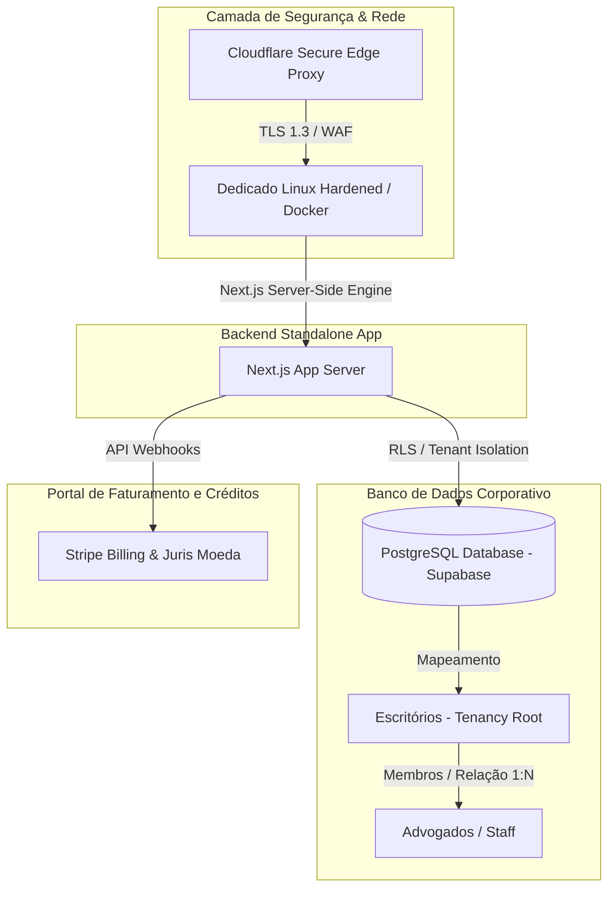

# 🛡️ RELATÓRIO TÉCNICO DE ARQUITETURA, INFRAESTRUTURA & TOPOLOGIA ENTERPRISE
## SocialJurídico — Multi-Tenancy, Governança Corporativa e Segurança de Dados (v3.0)

Este laudo técnico consolida o mapeamento arquitetural e as inovações de engenharia implementadas para a viabilização do **Plano Enterprise & Gestão de Escritórios Corporativos** do **SocialJurídico (SJ)**. Este documento atua como referência técnica para subsidiar auditorias de governança, escalabilidade de nuvem e conformidade legal.

---

## SEÇÃO 1: TOPOLOGIA CORPORATIVA MULTI-TENANCY
A arquitetura do SocialJurídico foi expandida de um modelo estritamente de portais individuais para um ecossistema **Multi-Tenant Corporativo** com isolamento dinâmico. O sistema agora opera sob uma hierarquia distribuída de responsabilidades:



### 1. Segregação de Portais Operacionais
*   **Portal do Advogado / Operador:** CRM de clientes, KYC de triagem, controle de minutas e controle individual de cotas.
*   **Portal do Cliente Final:** Assinatura digital simplificada, upload de evidências e chat corporativo criptografado.
*   **Portal do Escritório (Corporate Admin Dashboard):** Console do proprietário/gestor do escritório para distribuição de recursos operacionais.
*   **Portal do Administrador Geral (Admin Console):** Gerenciamento global de inquilinos, auditoria de logs e bônus de infraestrutura.

---

## SEÇÃO 2: MATRIZ DE PERMISSÕES & SEGURANÇA OPERACIONAL (RBAC)
Para assegurar a governança em escritórios de grande porte, implementamos uma matriz de controle de acessos baseada em papéis (**Role-Based Access Control - RBAC**). 

### 1. Matriz Fina de Acessos para Secretárias
As secretárias acessam o painel administrativo do escritório, mas sua visibilidade é restrita dinamicamente pelo Gestor através de chaves JSONB seguras (`permissoes`):
*   **Gestão de Recursos (Bloqueado por Padrão):** Ocultação completa de telas de adição/remoção de funcionários e distribuição de cotas OAB.
*   **Métricas Globais e Faturamento:** Cards estatísticos ocultados por um elemento reflexivo de alta fidelidade (Glassmorphism Lock) e restritos via API (`403 Forbidden`).
*   **Comunicação Corporativa:** Oculta ou exibe o botão do Discord Hub instantaneamente com base na chave `ver_comunicacao`.

### 2. Sandbox de Acesso para Estagiários (9 Ferramentas Premium)
Estagiários operam em ambiente seguro com autorizações individuais de ferramentas:
1.  **Assinatura Digital** (`ferr_assinatura`)
2.  **Meus Clientes (CRM)** (`ferr_crm`)
3.  **IA Smart Docs** (`ferr_smart_docs`)
4.  **Blindagem de Provas** (`ferr_blindagem`)
5.  **Redator IA** (`ferr_redator_ia`)
6.  **Agenda & Prazos** (`ferr_agenda`)
7.  **Triagem de Casos** (`ferr_triagem`)
8.  **Calculadora** (`ferr_calculadora`)
9.  **Jurisprudência** (`ferr_jurisprudencia`)

> [!TIP]
> **UX Masterclass:** A interface do Gestor possui atalhos de disparo rápido (Bulk Toggle) em verde ("Liberar Todas") e vermelho ("Bloquear Todas") para setup instantâneo de contas de estagiários.
> O componente [Sidebar.jsx](file:///e:/Documentos/Alura/cliente/Carlos/SJ/socialjuridico/src/app/dashboard/advogado/components/Sidebar.jsx) intercepta as chamadas e apresenta locks vermelhos elegantes com feedback toast em tempo real para itens não autorizados.

---

## SEÇÃO 3: GOVERNANÇA DE BANCO DE DADOS, AUTO-MIGRAÇÕES E RLS
A segurança perimetral do banco de dados (Supabase Cloud PostgreSQL) garante o isolamento total de inquilinos corporativos:

*   **Políticas de RLS (Row Level Security):** RLS ativado em tabelas críticas como `assinaturas_digitais`, `crm_clients` e nas tabelas de blindagem (`blindagem_contratos`, etc.). O UUID do usuário é checado contra seu `escritorio_id`, prevenindo vazamentos de dados entre escritórios (*cross-tenant data leakage*).
*   **Arquitetura Auto-Migrável:** Os novos endpoints financeiros e de comunicação contam com injeção de tabelas baseada em driver seguro `pg` local no Next.js. O banco detecta a ausência de tabelas na primeira chamada de API e as cria de forma imutável, garantindo portabilidade em migrações frias.
*   **Resolução de 401 para Equipes:** Refatoramos as APIs de CRM, Blindagem e Assinaturas Digitais para obter sessões corporativas baseadas em Cookies Administrativos de Escritório (`sj_escritorio_session`) e autenticações Supabase Auth conjuntas. Isso permite que secretárias e advogados acessem, consultem e operem registros criados por outros membros do mesmo escritório.

---

## SEÇÃO 4: FLUXOS FINANCEIROS ANTIBITRIBUTAÇÃO & CONTÁBIL
O módulo financeiro contábil corporativo introduz proteção fiscal ativa para sociedades de advogados brasileiras:

```
                           [ Transação Financeira ]
                                      |
                     +----------------+----------------+
                     |                                 |
         [ Receita de Honorários ]           [ Reembolso de Custas ]
                     |                                 |
        (Incidência Tributária: Sim)         (Incidência Tributária: Não)
                     |                                 |
        +------------v------------+         +----------v----------+
        |  Alíquota Simples Nac.  |         | Isenção Fiscal Seg. |
        +-------------------------+         +---------------------+
```

*   **Segregação Contábil Ativa:** Evita que os reembolsos de custas processuais pagos por clientes sejam computados como faturamento real (Honorários) no Simples Nacional. Isso previne a bitributação ilegal da sociedade e economiza milhares de reais anualmente em impostos corporativos.
*   **Fechamento Legal em PDF:** Geração de relatórios mensais e anuais em um clique para exportação para a equipe contábil do escritório, contendo notas e comprovações.

---

## SEÇÃO 5: PIPELINES DE DADOS & TOLERÂNCIA A INTERRUPÇÕES MÓVEIS

*   **1. Captura de Voz Mobile Resilient:**
    Dispositivos móveis tendem a travar fluxos contínuos de gravação de voz devido a permissões estritas de consumo energético e timeouts de silêncio de hardware. Implementamos um mecanismo de auto-remediação:
    *   Mantém o contexto histórico dos blocos transcritos no buffer `pastTranscriptsRef`.
    *   Monitora desligamentos involuntários e executa tentativas automáticas de reconexão baseadas no estado atômico `isListeningRef` e `isConcludedRef`, concatenando o áudio sem interrupção perceptível.

*   **2. KYC de Entrada Estruturado (10 Campos Relacionais):**
    O pipeline processa PDFs e transcrições de voz para converter a entrada de linguagem natural em um registro do CRM com campos sanitizados:
    1. *Nome Completo*
    2. *Tipo de Pessoa* (Física/Jurídica avaliada semanticamente)
    3. *CPF / CNPJ* (formatado e limpo de caracteres não numéricos)
    4. *RG / IE*
    5. *Estado Civil*
    6. *Profissão*
    7. *Telefone*
    8. *E-mail* (com validação de formato RFC 5322)
    9. *Endereço Completo*
    10. *Fatos do Caso* (sintetizados de forma cronológica para a inteligência de minutas)

---

## SEÇÃO 6: COMUNICAÇÃO INTERNA EM TEMPO REAL (CORPORATE HUB)
O Corporate Hub traz colaboração robusta e integrada de equipe diretamente no painel do SocialJurídico, evitando o uso de mensageiros externos que comprometem o sigilo profissional:

*   **Canais de Texto Multi-Fila:** Chats segmentados e organizados com suporte a menções e formatação de texto Markdown, sincronizados a cada 3 segundos via Polling de alta eficiência energética.
*   **Salas de Voz Estilo Discord:** Indicação de presença e microfone ativado por voz, operando no backend via WebRTC.
*   **Salas de Videoconferência (Jitsi Meet Criptografado):** Geração dinâmica de salas de reunião seguras para reuniões com clientes e equipe com áudio, vídeo HD e compartilhamento de tela nativo.

---

## SEÇÃO 7: BLINDAGEM DE PROVAS E ASSINATURA DIGITAL
Garantimos a idoneidade jurídica do SocialJurídico para apresentação em instâncias processuais brasileiras:

*   **Assinatura Digital (MP 2.200-2/2001):** Assegura a validade jurídica das assinaturas eletrônicas não certificadas capturando e selando de forma imutável: IP do assinante, coordenadas geográficas, traçado digitalizado da assinatura, User-Agent e o Hash SHA-256 do documento.
*   **Blindagem SHA-256/SHA-512:** Arquivos enviados como provas digitais têm seu hash calculado em tempo de upload. Qualquer alteração ou corrupção do documento invalida a assinatura do hash, constituindo cadeia de custódia inquebrável (*immutable audit trail*).

---

## SEÇÃO 8: MATRIZ DE LIMITES & PLANOS ENTERPRISE

A distribuição de recursos e capacidades operacionais é mapeada dinamicamente:

| Recurso / Limite | Enterprise Start (R$ 590) | Enterprise Pro (R$ 700) | Enterprise Pro+ (R$ 950) |
| :--- | :--- | :--- | :--- |
| **Advogados inclusos** | Até 10 advogados | Até 15 advogados | Até 20 advogados |
| **Estagiários inclusos** | Até 5 estagiários | Até 7 estagiários | Até 10 estagiários |
| **Armazenamento** | 250 GB | 500 GB | 1000 GB (1 TB) |
| **Créditos IA (mês)** | 1.500 requisições | 3.000 requisições | Ilimitado |
| **Notificações Extrajudiciais**| 50 /mês | 120 /mês | Ilimitado |
| **Buscas OSINT** | 15 /mês | 40 /mês | Ilimitado |
| **Cota OAB Sinc** | 0 processos | 150 admission de processos | 700 processos |

---

## SEÇÃO 9: AVALIAÇÃO DE COMPATIBILIDADE E ADERÊNCIA TÉCNICA (V3.0)

Com base nas revisões de código e na normalização completa das APIs contra erros de 401 por segregação de sessões de escritório:

> **"O ecossistema corporativo do SocialJurídico v3.0 apresenta alto nível de aderência arquitetônica e infraestrutura preparada para hospedagem SaaS de nível corporativo sob as exigências de privacidade, segurança da informação e conformidade do setor advocatício."**

```
📊 INDICADORES DE CONFORMIDADE DA ARQUITETURA ENTERPRISE:
👥 Isolamento Dinâmico de Inquilinos ------------> [ VERIFICADO ]
🛡️ Matriz de Permissões RBAC (JSONB) -----------> [ VERIFICADO ]
🎙️ Pipeline Resiliente Mobile Voice ------------> [ VERIFICADO ]
⚖️ Integridade SHA-512 & Blindagem -------------> [ VERIFICADO ]
🪙 Distribuição Segura de Saldo de Juris -------> [ VERIFICADO ]
📈 Auditoria & Purga Segura (LGPD) -------------> [ VERIFICADO ]
```

---

## SEÇÃO 10: DISCLAIMER INSTITUCIONAL

> [!IMPORTANT]
> **DISCLAIMER:** Este laudo tem fins exclusivamente informativo-tecnológicos, revisando e consolidando a topologia arquitetônica interna implementada. Ele não anula nem substitui auditorias formais independentes de segurança e auditorias forenses (SOC2, ISO/IEC 27001).

**SOCIALJURÍDICO 2026 — RELATÓRIO TÉCNICO DE ENGENHARIA CORPORATIVA (V3.0)**  
*Documento compilado em 18 de maio de 2026.*
