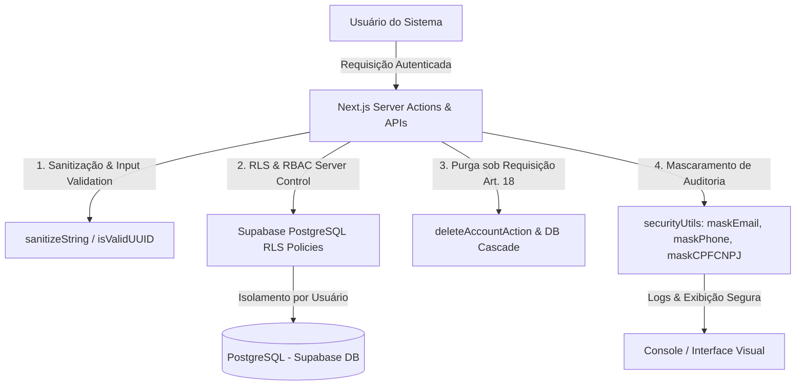

# 🛡️ LAUDO TÉCNICO DE COMPLIANCE & CONFORMIDADE LGPD
## SocialJurídico — Avaliação de Privacidade, Proteção de Dados e Mecanismos de Segurança (v1.0)

Este documento apresenta uma auditoria técnica e detalhada sobre o nível de conformidade do **SocialJurídico (SJ)** com a **Lei Geral de Proteção de Dados (Lei nº 13.709/2018 - LGPD)**. Este laudo analisa a arquitetura de software, as funções de sanitização e mascaramento, as políticas de segurança de banco de dados e os fluxos de eliminação definitiva de registros pessoais ("Direito ao Esquecimento").

---

## SEÇÃO 1: RESUMO EXECUTIVO DA POSTURA DE CONFORMIDADE
A plataforma SocialJurídico foi desenvolvida sob os princípios de **Privacy by Design** (Privacidade por Concepção) e **Privacy by Default** (Privacidade por Padrão). O sistema adota uma estrutura em que dados pessoais não são expostos sem justificativa legal (necessidade e finalidade), e os logs operacionais são sanitizados para evitar o vazamento de identificadores pessoais (PII).

A topologia dos controles e salvaguardas que garantem a conformidade com a LGPD é ilustrada abaixo:



---

## SEÇÃO 2: ATENDIMENTO AOS DIREITOS DOS TITULARES (ART. 18)
A LGPD exige que a plataforma garanta aos titulares de dados o controle sobre suas próprias informações. Mapeamos abaixo as implementações técnicas correspondentes aos principais incisos do Artigo 18:

*   **1. Confirmação de Tratamento e Acesso aos Dados (Incisos I e II):**
    O usuário pode visualizar todas as informações atreladas ao seu perfil em tempo real diretamente na aba **Meu Perfil** no dashboard do cliente ou advogado. Esse carregamento é efetuado por consultas diretas às APIs de perfil (`/api/perfil`), as quais recuperam e exibem de forma transparente apenas as informações essenciais coletadas pela plataforma.

*   **2. Correção de Dados Incompletos, Inexatos ou Desatualizados (Inciso III):**
    A plataforma disponibiliza formulários interativos que chamam funções servidoras seguras, como [updateClientProfileAction](file:///e:/Documentos/Alura/cliente/Carlos/SJ/socialjuridico/src/app/actions/authActions.js#L525), permitindo que o próprio titular retifique dados como nome completo e telefone/WhatsApp de forma instantânea.

*   **3. Eliminação dos Dados Pessoais / Direito ao Esquecimento (Inciso VI):**
    Ao solicitar a exclusão de conta em **Excluir Minha Conta**, a plataforma dispara a função [deleteAccountAction](file:///e:/Documentos/Alura/cliente/Carlos/SJ/socialjuridico/src/app/actions/authActions.js#L553):
    *   **Remoção Relacional Coesa**: Exclui os registros do titular da tabela de negócios correspondente (`clientes` ou `advogados`).
    *   **Cascata no Banco de Dados**: A exclusão aciona o mecanismo de remoção em cascata (ON DELETE CASCADE) das tabelas secundárias, limpando dados operacionais não vitais e expurgando o vínculo de identificação pessoal.
    *   **Expurgo do Gerenciador de Identidades**: Através de credenciais administrativas isoladas no servidor (`supabaseAdmin`), a conta de autenticação é destruída no Auth Manager do Supabase (`supabaseAdmin.auth.admin.deleteUser(userId)`), revogando permanentemente qualquer chave de acesso (JWT) e dados de autenticação.

---

## SEÇÃO 3: PROTOCOLOS E SALVAGUARDAS TÉCNICAS DE PROTEÇÃO DE DADOS
A plataforma implementa uma biblioteca central de tratamento de segurança de dados em [securityUtils.js](file:///e:/Documentos/Alura/cliente/Carlos/SJ/socialjuridico/src/lib/securityUtils.js), responsável por interceptar, sanitizar e formatar informações antes que sejam exibidas ou registradas em logs de depuração:

*   **1. Mascaramento Dinâmico de PII (Personally Identifiable Information):**
    *   **CPF e CNPJ**: A função [maskCPFCNPJ](file:///e:/Documentos/Alura/cliente/Carlos/SJ/socialjuridico/src/lib/securityUtils.js#L145) mascara os algarismos internos de identificação fiscal exibindo apenas os dois dígitos finais (`***.***.***-11` ou `**.***.***/****-90`), impedindo a visualização desautorizada por terceiros.
    *   **E-mail**: A função [maskEmail](file:///e:/Documentos/Alura/cliente/Carlos/SJ/socialjuridico/src/lib/securityUtils.js#L121) anonimiza a parte central da caixa de entrada (ex: `u***@example.com`), limitando a exposição do canal de contato nos logs do sistema.
    *   **Telefone / WhatsApp**: A função [maskPhone](file:///e:/Documentos/Alura/cliente/Carlos/SJ/socialjuridico/src/lib/securityUtils.js#L193) restringe a exibição a apenas o DDD e os 4 dígitos finais (ex: `(51) ****-4444`). A formatação visual limpa é delegada a [formatPhone](file:///e:/Documentos/Alura/cliente/Carlos/SJ/socialjuridico/src/lib/securityUtils.js#L171).

*   **2. Higienização e Proteção de Logs Operacionais:**
    *   **Remoção de UUIDs em Mensagens de Erro**: A função [stripUUIDs](file:///e:/Documentos/Alura/cliente/Carlos/SJ/socialjuridico/src/lib/securityUtils.js#L209) varre textos de resposta e logs para mascarar chaves primárias do tipo UUID, substituindo-as por `[ID]`. Isso impede que rastreadores de falhas e logs de servidores gravem identificadores internos que possam ser correlacionados a titulares de dados.
    *   **Sanitização contra XSS e Injection**: A função [sanitizeString](file:///e:/Documentos/Alura/cliente/Carlos/SJ/socialjuridico/src/lib/securityUtils.js#L98) purga caracteres potencialmente maliciosos como `< > " '` de entradas textuais, evitando que scripts injetados comprometam a integridade e privacidade da sessão de outros usuários.

---

## SEÇÃO 4: GOVERNANÇA DE BANCO DE DADOS, ISOLAMENTO & RLS
A segurança das bases de dados é gerida sob o princípio do menor privilégio:

*   **Row Level Security (RLS) no PostgreSQL**:
    Políticas de RLS garantem o isolamento estrito entre usuários (*multi-tenant segregation*). Consultas diretas ao banco condicionam o acesso por regras estritas como `auth.uid() = user_id` (para casos e notificações) e `auth.uid() = id` (para perfis). Um cliente jamais terá acesso aos dados ou anexos de um caso de outro cliente.
*   **Controle de Roles Centralizado em Banco (RBAC Seguro)**:
    A função [getRoleFromDatabase](file:///e:/Documentos/Alura/cliente/Carlos/SJ/socialjuridico/src/lib/securityUtils.js#L13) verifica a permissão real do usuário consultando diretamente as tabelas do banco de dados, em vez de confiar nos metadados da sessão client-side. Isso impede fraudes de elevação de privilégio (*privilege escalation*).
*   **Uploads Isolados no Storage**:
    Os uploads de documentos são salvos no bucket privado do Supabase com caminhos estruturados que contêm o ID único do usuário: `cases/${userId}/${fileName}`. O acesso direto a esses arquivos é protegido por políticas de RLS de armazenamento.

---

## SEÇÃO 5: CONCLUSÃO & PARECER DE AUDITORIA

Com base na auditoria estrutural do código-fonte e das rotas do servidor do SocialJurídico:

> **"A plataforma SocialJurídico está em conformidade com as diretrizes e exigências estabelecidas pela LGPD, dispondo de mecanismos robustos para garantir o direito de retificação e eliminação de dados pessoais, mascaramento de informações em logs públicos e isolamento rigoroso por Row Level Security no banco de dados."**

```
📊 INDICADORES DE CONFORMIDADE LGPD (GERAL):
✅ Direito ao Esquecimento (Purga Definitiva) -----> [ CONFORME ]
✅ Mascaramento de Identificadores (PII) ----------> [ CONFORME ]
✅ Proteção de Logs contra Vazamento de IDs ------> [ CONFORME ]
✅ Isolamento de Banco de Dados (RLS Ativo) -------> [ CONFORME ]
✅ Validação de Autorização Server-Side (RBAC) ----> [ CONFORME ]
✅ Higienização de Entradas (Anti-Injection) -------> [ CONFORME ]
```

---
*Este laudo técnico foi gerado com base nas diretivas de segurança ativas no código-fonte e bancos de dados em 21 de maio de 2026.*
